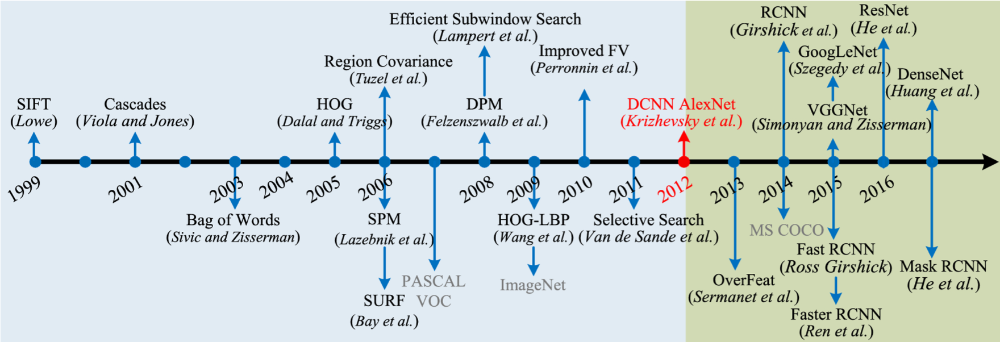
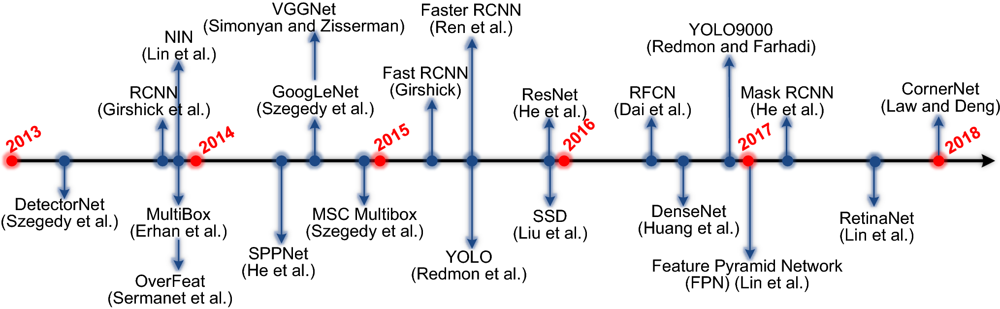

# awesome-semantic-understanding-for-aerial-scene 

<!-- [`awesome.re`](https://awesome.re/) -->

 

A curated list of awesome resources for semantic understanding of aerial scene,  e.g. tutorials, papers, books, datasets, libraries and software.  inspired by [awesome-php](https://github.com/ziadoz/awesome-php).

[TOC]

Table of content

- [Tutorial](#Tutorial)
  - [Datasets](#Datasets)

- [Dataset repo](##Dataset Repository)

## Tutorials

- 多源多谱段图像融合的数学方法与应用 (A Review of MS+PAN), 肖亮, 201911 [[Page]](https://mp.weixin.qq.com/s/NRmeggM6wXUPPX90auKYqA)

- 吴一戎: 遥感与智能-AI赋能遥感技术的思考 [[Page]](https://mp.weixin.qq.com/s/pNZzs4udjpGDugZOGxWJdw)

## Libraries

### Remote Sensing

- [Remote Sensing Code Library (RSCL)](http://rscl-grss.org/index.php): RSCL is a free online registry of software codes of interest to remote sensing scientists and engineers. The RSCL is indexed by IEEE and is citable by using the DOI assigned to each code. [Pansharpening Toolbox]

- [A list of open-source software for photogrammetry and remote sensing](https://photogrammetric-vision.weebly.com/software.html): including point cloud, 3D reconstruction, GIS/RS, GPS, image processing, etc.

- [DeepOSM](https://github.com/trailbehind/DeepOSM): Train a deep learning net with OpenStreetMap features and satellite imagery for classifying roads and features.

- Terrapattern [[Homepage]](http://www.terrapattern.com/) [[Code]](https://github.com/CreativeInquiry/terrapattern)

  Terrapattern is a prototype for helping people quickly detect “patterns of interest” in satellite imagery (or extremely large geographical areas for specific visual features). Examples might include methane blowholes, oil derricks, large fiberglass lumberjacks, or illegal farms.

- LocaSpace Viewer: 3D digital earth software, including satellite images, map, trajectory. 

  

### Object Detection

- **Generic Object Detection Reposity**

  >**Detectron**
  >
  >Detectron is a Caffe2-based open-sourse object detection framework developed by Facebook. Then Facebook released Pytorch-based object detection platform - Detectron2. It supports: FPN、Mask R-CNN、Non-local、 Learning to Segment Every Thing、 DensePose; Group Normalization、RetinaNet、Faster R-CNN、Fast R-CNN、R-FCN, etc.
  >
  >**SimpleDet** 
  >
  >A generic and simple open-source object detection framework by TuSimple, based on MXNet. SimpleDet support: Mask/Faster RCNN，FPN，RetinaNet，CascadeRCN，TridentNet，Soft NMS，DCN，DCNv2, etc.
  >
  >**MMDetection**
  >
  >A Pytorch-based open-source object detection framework by CUHK MMLab. The supported detection models are far more than other object detection libraries. 
  >
  >MMDetection toolbox is with variable module-based design,  and decomposes the network architecture of object detection into different components. Users can build personalized detection architecture on demands. It includes 25+ object detection algorithms, such as FCOS, FASF, Grid R-CNN, GCNet, HRNet etc. 
  >
  >Reference: MMDetection: Open MMLab Detection Toolbox and Benchmark, 2019. 
  >
  >**PaddlePaddle**
  >
  >百度自研的深度学习平台飞桨，包括经典的单阶段的目标检测器SSD，运行速度大大提升的Faster R-CNN，像素级别检测的MaskR-CNN，速度和精度均衡的YOLO v3，基于SSD的单阶段人脸检测器PyramidBox.

- [Vehicle-Detection-and-Tracking](https://github.com/kcg2015/Vehicle-Detection-and-Tracking)

  This repo illustrates the detection and tracking of multiple vehicles using a camera mounted inside a self-driving car. Vehicle detection using Tensorflow Object Detection API and tracking using Kalman-filtering.

- [vdetlib](https://github.com/myfavouritekk/vdetlib)

  The vdetlib python library serves to detection objects in videos. It was originally developed for the ImageNet VID challenge introduced in ILSVRC2015. It contains components such as region proposal, still-image object detection, generic object tracking, spatial max-pooling and temporal convolution. Reference: Object Detection from Video Tubelets with Convolutional Neural Networks, CVPR2016

- [T-CNN](https://github.com/myfavouritekk/T-CNN)

  ImageNet 2015 Object Detection from Video (VID). The TCNN framework is a deep learning framework for object detection in videos. This framework was orginally designed for the ImageNet VID chellenge in ILSVRC2015. Reference: T-CNN: Tubelets with Convolutional Neural Networks for Object Detection from Videos, arXiv2016

- [TencentYoutuResearch](https://github.com/TencentYoutuResearch)

  Include YOLO, DBG(Action), DSFD/FAN/FHR(Face detection/attribute/alignment) 

- [Saliency Map Algorithm](http://www.vision.caltech.edu/~harel/share/gbvs.php)

  MATLAB Source Code for some traditional saliency map detection.

## Datasets

### Dataset Repository

- [遥感数据集](https://zhangbin0917.github.io/2018/06/12/遥感数据集/): A complete list for remote sensing dataset collected by Zhang Bin updated in 2019, including image classification, object detection, semantic segmentation, building detection, road detection, ship detection, change detection, super resolution, and Lidar. :star:
- [Awesome Satellite Imagery Datasets](https://github.com/chrieke/awesome-satellite-imagery-datasets): Competition dataset, instance segmentation, object detection, semantic segmentation, scene classification, road extraction, building detection, land cover classification :star:

- [CVonline: Image Databases](http://homepages.inf.ed.ac.uk/rbf/CVonline/Imagedbase.htm): A dataset list about CV/ML/RS.

- [Machine learning datasets](https://www.datasetlist.com/): Dateset collection for maching learning

- [全球十九大主流卫星遥感数据下载平台](https://mp.weixin.qq.com/s/oDyTLvX50eu3kPyeNrE2oQ)

- [全球五大遥感卫星简介及其数据下载](https://mp.weixin.qq.com/s/yWtI0_VHTd9x45p8rwVf2w)

- [六大GIS地图数据源](https://chuansongme.com/n/1581430352843): Natural Earth Data, OSM, Diva GIS, UNEP Env Data, ISCGM, BDP.

  

### Satellite Image Understanding

- [DeepGlobe2018](): 

  A Challenge to Parse the Earth through Satellite Images

- [BigEarthNet](http://bigearth.net/): 

  A new large-scale Sentinel-2 benchmark archive for land-cover classification, which consists of 590,326 Sentinel-2 image patches from 125 Sentinel-2 tiles acquired between June 2017 and May 2018 over the 10 Europe countries. Reference: BigEarthNet: A Large-Scale Benchmark Archive for Remote Sensing Image Understanding, IGRASS2019.

- [EuroSAT](https://github.com/phelber/eurosat): 

  A large-scale dataset for land use and land cover classification with Sentinel-2 satellite images, covering 13 spectral bands and consisting out of 10 classes with in total 27,000 labeled and geo-referenced images. 

- [SpaceNet](https://spacenetchallenge.github.io/): 

  Off-Nadir Building Detection. The dataset includes 27 WorldView 2 Satellite images from 7 degrees to 54 degrees off-nadir all captured within 5 minutes of each other. The dataset covers over 665 square kilometers of downtown Atlanta and ~126,747 buildings footprints labeled from a nadir image. [[Intro]](https://devblogs.nvidia.com/exploring-spacenet-dataset-using-digits/)

  Spacenet Challenge Round 5 - [Road Network Extraction, Routing, Travel Time Estimation](https://www.topcoder.com/challenges/30099956) (CosmiQ Works, Maxar, Intel, AWS, Sep 2019): 
  2300 image chips, street geometries with location, shape and estimated travel time, 3/8band Worldview-3 imagery (0.3m res.), 4 global cities, 1 holdout city for leaderboard evaluation, [APLS](https://github.com/CosmiQ/apls) metric, [baseline model](https://github.com/CosmiQ/cresi)

  

### Object Detection for Aerial Scene

航空图像目标特性: 尺度多样性、目标多方向分布、视角特殊性、小目标和密集分布、背景复杂度高.

|        Name        | Intro                                                        | Link                                                         |
| :----------------: | :----------------------------------------------------------- | ------------------------------------------------------------ |
|        DOTA        | - 大规模航空遥感图像目标检测数据集; - 2806 aerial images from different sensors and platforms;  - Image size: 800 × 800 to about 4000 × 4000;  - objects with a wide variety of scales, orientations, and shapes; - 15 common object categories; - DOTA contains 188, 282 instances;  - Labeled by an arbitrary (8 dof) quadrilateral.   Reference:  [**2018CVPR**] Gui-Song Xia, Xiang Bai, etc. DOTA: A Large-scale Dataset for Object Detection in Aerial Images [武汉大学] | [[Dataset]](http://captain.whu.edu.cn/DOTAweb/) [[Note]](https://zhuanlan.zhihu.com/p/36770030) |
|        DIOR        | - 大规模光学遥感图像中目标检测基准数据集 - 23463 images and 190288 object instances; - 20 object categories; Reference:  Ke Li, Gang Wan, Gong Cheng, Liqiu Meng, Junwei Han. Object Detection in Optical Remote Sensing Images: A Survey and A New Benchmark. 2019.8 [西北工业大学] |                                                              |
|       xView        | - 美国国防部国防创新部门实验室(DIUx)、DigitalGlobe和美国国家地理空间情报局联合发布的高空卫星图像目标检测数据集xView; - xView包含60个类别的100万个不同对象，分布在1,400平方公里的卫星图像上，最大地面样本分辨率为0.3米(Worldview-3); - 该数据集旨在测试图像识别的各个领域，包括：学习效率，细粒度类别检测和多尺度识别等; - COCO data format, pre-trained Tensorflow and Pytorch baseline models - [DIUx xView 2018 Detection Challenge](http://xviewdataset.org/) Reference:  [**201802**] xView: Objects in Context in Overhead Imagery.   | [Dataset](http://xviewdataset.org/)                          |
|    NWPU VHR-10     | - 航天遥感目标检测数据集 - 800张图像，其中包含目标的650张，背景图像150张; - 目标包括：飞机、舰船、油罐、棒球场、网球场、篮球场、田径场、港口、桥梁、车辆10个类别; Reference:  [**2018TGRS**] Rotation-insensitive and context augmented object detection in remote sensing images. [2016ISPRSJ] A survey on object detection in optical remote sensing images | [[Dataset]](http://jiong.tea.ac.cn/people/JunweiHan/NWPUVHR10dataset.html) [[V1]](http://pan.baidu.com/s/1hqwzXeG) [[V2]](https://pan.baidu.com/s/1PUhRxDDqUN2cr3tDyXvasw) |
|      UCAS-AOD      | - 中国科学院大学模式识别与智能系统开发实验室标注的，只包含两类目标：汽车，飞机，以及背景负样本。 - [**2015ICIP**] Orientation Robust Object Detection in Aerial Images Using Deep Convolutional Neural Network. |                                                              |
|    RSOD-Dataset    | - An open dataset for object detection in remote sensing images, including aircraft, playground, overpass and oiltank; - 数目分别为:  飞机：4993 aircrafts in 446 images.  操场：191 playgrounds in 189 images.  立交桥：180 overpass in 176 overpass.  油桶：1586 oiltanks in 165 images. - It is collected by Zhifeng Xiao, LIESMARS, WHU.  [**2016TGRS**] Accurate Object Localization in Remote Sensing Images Based on Convolutional Neural Networks | [[Dataset]](https://github.com/RSIA-LIESMARS-WHU/RSOD-Dataset-) |
| TGRS-HRRSD-Dataset | - High Resolution Remote Sensing Detection (HRRSD) - 中国科学院西安光学精密机械研究所光学影像分析与学习中心制作用于研究高分辨率遥感图像目标检测的数据集. - It contains 21,761 images acquired from Google Earth and Baidu Map with the spatial resolution from 0.15-m to 1.2-m. - 55,740 object instances, 13 categories; - This dataset is divided as several subsets, image numbers in each subset are 5401 for ‘train’, 5417 for ‘val’, and 10943 for ‘test’. And ‘train-val’ subset is a merge of ‘train’ and ‘val’. [**2019TGRS**] Hierarchical and Robust Convolutional Neural Network for Very High-Resolution Remote Sensing Object Detection | [[Dataset]](https://github.com/CrazyStoneonRoad/TGRS-HRRSD-Dataset) |
|                    |                                                              |                                                              |

#### Object detection in UAV

-  **VisDrone2018/2019** [[Dataset]](http://www.aiskyeye.com/) [[PDF]](http://www.aiskyeye.com/upfile/Vision_Meets_Drones_A_Challenge.pdf) 
  Vision Meets Drones: A Challenge, 2018. It includes 4 tasks:   
  - Task 1: object detection in images challenge. The task aims to detect objects of predefined categories (e.g., cars and pedestrians) from individual images taken from drones. 
  - Task 2: object detection in videos challenge. The task is similar to Task 1, except that objects are required to be detected from videos.  
  - Task 3: single-object tracking challenge. The task aims to estimate the state of a target, indicated in the first frame, in the subsequent video frames.  
  - Task 4: multi-object tracking challenge. The task aims to recover the trajectories of objects in each video frame.  

- **UAVDT**: A Unmanned Aerial Vehicle dataset for Object Detection and Tracking [[Data]](https://sites.google.com/site/daviddo0323/projects/uavdt)

  Selected from 10 hours raw videos, about 80, 000 represen-tative frames are fully annotated with bounding boxes as well as up to 14 kinds of attributes (e.g., weather condition, fying altitude, camera view, vehicle category, and occlusion) for three fundamental computer vision tasks: object detection, single object tracking, and multiple object tracking. 

  Reference: [**2018ECCV**] The Unmanned Aerial Vehicle Benchmark: Object Detection and Tracking.

- **Flying Object Detection dataset** [[Dateset&Codes]](https://www.epfl.ch/labs/cvlab/research/uav/research-unmanned-detection/)
  To detect flying objects such as UAVs and aircrafts.
  Reference: Detecting Flying Objects using a Single Moving Camera, CVPR2015, PAMI2017

  

#### Specific object detection

- **Cars Overhead With Context (COWC)** [[Dataset]](https://gdo152.llnl.gov/cowc/) [[Howtouse]](https://arthurdouillard.com/post/nato-challenge/)

  COWC data set is a large set of annotated cars from overhead. 

  It is useful to learn to detect and/or count cars. 

  Data from overhead at 15 cm per pixel resolution at ground. 

  32,716 unique annotated cars; 

  58,247 unique negative examples. 

  Reference: [**2016ECCV**] A Large Contextual Dataset for Classification, Detection and Counting of Cars with Deep Learning. 

- **WPAFB 2009 DATASET** [[Page]](https://www.sdms.afrl.af.mil/index.php?collection=wpafb2009)

  Wright-Patterson Air Force Base (WPAFB) 2009 dataset is provided by the U.S. Air Force Research Lab (AFRL). 

  The dataset contains: 1,537 stitched images in NITF 2.1 (w/rset): 1/3 for algorithm training with image truth; 1/3 for algorithm self-test with image truth; 1/3 for algorithm self-eval without image truth. Around 18,000 fully ground-truthed vehicle tracks. 

  WPAFB contains imagery from a large format Earth Observation platform. The scene is a flyover of WPAFB, OH and the surrounding area. The sensor is a large format monochromatic electro-optical sensor comprised of a matrix of six cameras. They were mosaicked to form a combined image of the scene. Each camera had a focal length of 105 mm. 

- **SAR-Ship-Dataset** [[Dataset]](https://github.com/CAESAR-Radi/SAR-Ship-Dataset)

  中国科学院空天信息研究院王超研究员团队构建的多源、多模式的SAR船舶切片数据集；

  102 Chinese Gaofen-3 images and 108 Sentinel-1 images;

  43,819 ship chips of 256 pixels in both range and azimuth;

  59535 ship instances;

  高分三号的成像模式是Strip-Map (UFS)、Fine Strip-Map 1 (FSI)、Full Polarization 1 (QPSI)、Full Polarization 2(QPSII)和Fine Strip-Map 2 (FSII)。这5种成像模型的分辨率分别是3m、5m、8m、25m和10m。Sentinel-1的成像模式是条带模式（S3和S6）和宽幅成像模式;

  高分三号数据覆盖的范围主要是我国的港口和亚洲的若干港口；Sentinel-1 S3覆盖的范围是巴西圣保罗港口附近；Sentinel-1 S6覆盖的范围是美国休斯顿港口。考虑到Sentinel-1图像的重访周期是12天，我们分别展示一景条带S3和条带S6的覆盖范围。这些SAR图像的信息包括成像模式、分辨率、带宽、入射角、极化方式和图像数量.

  Reference: [**2019RS**] A SAR Dataset of Ship Detection for Deep Learning under Complex Backgrounds.

  > 一个小规模的SAR Ship Detection Dataset (SSDD): 
  >
  > 该数据集的SAR图像是RadarSat-2、TerraSAR-X和Sentinel-1; 
  >
  > 数据由含2456船舶的1160船舶切片; 
  >
  > 其图像的分辨率既包括高分辨率和中低分辨率图像;
  >
  > 图像的尺寸不固定，即船舶的切片的长和宽是不定的. 
  >
  > Reference: Li J , Qu C , Shao J . Ship detection in SAR images based on an improved faster R-CNN, IEEE BIGSARDATA Conf, 2017.

- **ESRI Data Science Challenge 2019** [[Homepage]](https://www.hackerearth.com/en-us/challenges/hiring/esri-data-science-challenge-2019/) [[Dataset-SwimmingPoolCarDet]](https://www.kaggle.com/kbhartiya83/swimming-pool-and-car-detection) [[WinningSolution]](https://github.com/kunwar31/ESRI_Object_Detection) [[3rdSolution]](https://towardsdatascience.com/object-detection-on-aerial-imagery-using-retinanet-626130ba2203) 

- **Nanonets** [[Homepage]](https://nanonets.com/drone/)
  A company to create custom Deep Learning models to detect a variety of objects in images captured by drones with minimal data & limited knowledge of machine learning.

#### Instance Segmentation

- iSAID: A Large-scale Dataset for Instance Segmentation in Aerial Images, CVPRW2019 [[Dataset]](https://captain-whu.github.io/iSAID/)

### Building Detection/Segmentation

- [**WHU Building Dataset**](http://study.rsgis.whu.edu.cn/pages/download/) (WHU, 2018)

  目前范围最大、精度最高、涵盖多种样本形式(栅格、矢量)、多类数据源(航空、卫星)的大场景、高分辨率遥感建筑物数据库, 分成航空建筑物数据库和卫星建筑物数据库。航空建筑物数据库影像来自新西兰Christchurch市，涵盖22, 000栋形式各异的建筑，地面分辨率0.075 m，覆盖450 km2。原始的矢量数据和航空影像都由[新西兰土地信息服务](https://data.linz.govt.nz/)提供，然而原始数据存在大量的错误，如缺失、错位等，无法直接应用。因此在ArcGIS软件中采用全人工的方式对其进行了前后3次交叉检查和修订，以制作高质量的建筑物矢量图。

  卫星数据库包含数据集Ⅰ和数据集Ⅱ，其中数据集Ⅰ包含204张512×512像素的图像，分别采集至不同卫星传感器(ZY-3号、IKONOS、Worldview系列等)、不同分辨率(0.3 m~2.3 m)、包括中国、欧洲、北美、南美和非洲等五大洲的不同城市，这套数据库与航空数据集有明显的区别，可用于深度学习泛化能力的评估。

  卫星数据集Ⅱ包含6张相邻的、色彩差异明显的卫星遥感影像，地面分辨率0.45 m，覆盖东亚地区860 km2的土地。与航空数据集类似，整个区域被分成17 388个512×512像素的瓦片。数据集还包含一个建筑物变化检测的数据集。

  Reference: *Fully Convolutional Networks for Multisource Building Extraction From an Open Aerial and Satellite Imagery Data Set, 2018TGRS*. 

  *遥感影像建筑物提取的卷积神经元网络与开源数据集方法, 2019Acta Geodaetica et Cartographica Sinica*.

- **Microsoft Building Footprints** [**Canada**](https://github.com/Microsoft/CanadianBuildingFootprints) **&** [**USA**](https://github.com/microsoft/USBuildingFootprints) *(Microsoft, Mar 2019)*

  Canada: this dataset contains 11,842,186 computer generated building footprints in all Canadian provinces and territories in GeoJSON format.

  USA: this dataset contains 125,192,184 computer generated building footprints in all 50 US states. 

  The image is delineation based on Bing imagery using ResNet34 architecture.

- [**AIRS (Aerial Imagery for Roof Segmentation)**](https://www.airs-dataset.com/) (Chen 2019)

  AIRS is a large-scale dataset towards automtic mapping of buildings. It aims at benchmarking the algorithms of roof segmentation from very-high-resolution aerial imagery. The main features of AIRS can be summarized as:

  - 457 km^2 coverage of orthorectified aerial images with over 226,342 labeled buildings;
  - Very high spatial resolution of imagery (0.075m);
  - Refined ground truths that strictly align with roof outlines;
  - covers almost the full area of Christchurch, in the South Island of New Zealand;
  - To eliminate the impact of relief displacement, the ground truths for buildings are carefully refined to align with their roofs.
  - Therefore, the segmentation task posed for AIRS contains two semantic classes: roof and non-roof pixels.

  Reference: Chen Q, Wang L, Wu Y, et al. Aerial imagery for roof segmentation: A large-scale dataset towards automatic mapping of buildings, 2019 ISPRSJ.

- **Open AI Challenge** (2019)

  Orignized by *MathWorks, WeRobotics, Wordlbank, DrivenData, Dec 2019*.

  [Open AI Caribbean Challenge: Mapping Disaster Risk from Aerial Imagery](https://www.drivendata.org/competitions/58/disaster-response-roof-type/page/143/): Predict building roof type (5 categories, e.g. concrete, metal etc.) of provided building footprints (22,553), RGB UAV imagery (4cm res., 7 areas in 3 Carribbean countries). [Open AI Tanzania Building Footprint Segmentation Challenge](https://competitions.codalab.org/competitions/20100): in the form of GeoTIFF files along with GeoJSON files that contain the ground truth annotations.

- [**xView 2 Building Damage Asessment Challenge**](https://xview2.org/) *(DIUx, Nov 2019)*
  550k building footprints & 4 damage scale categories, 20 global locations and 7 disaster types (wildfire, landslides, dam collapses, volcanic eruptions, earthquakes/tsunamis, wind, flooding), Worldview-3 imagery (0.3m res.), pre-trained baseline model. Paper: Creating xBD: A Dataset for Assessing Building Damage from Satellite Imagery, 2019CVPRW

- [**SpaceNet Buildings Dataset**](https://spacenetchallenge.github.io/) (2019)

  Spacenet Off Nadir building dataset. The dataset is to extract map-ready building footprints from high-resolution satellite imagery from high off-nadir imagery. 

  This dataset contains 27 8-Band WorldView-2 images taken over Atlanta, GA on December 22nd, 2009. They range in off-nadir angle from 7 degrees to 54 degrees. 

  The 27 images are broken into 3 segments based on their off-nadir angle: Nadir, 0-25 degrees; Off-nadir, 26 degrees - 40 degrees; Very Off-nadir, 40-55 degrees. 

  The entire set of images is tiled into 450m x 450m tiles. 

  Each Collection folder than has 3 types of images: PAN (single channel, 16-bit grayscale, ~50 cm resolution), MUL (8\*16-bit, ~2m resolution), PanSharpen (4 channels, 3*16-bit, ~50 cm resolution). 

- [**CrowdAI Mapping Challenge**](https://www.crowdai.org/challenges/mapping-challenge) (2018)

  A competition dataset of individual tiles of satellite imagery as RGB images, and their corresponding annotations of where an image is there a building.

  - Training Set: **280741** tiles (as **300x300** pixel RGB images) of satellite imagery, along with their corresponding annotations in MS-COCO format
  - Validation Set: **60317** tiles (as **300x300** pixel RGB images) of satellite imagery
  - Test Set: for Round-1, where you are provided with **60697** files (as **300x300** pixel RGB images) and your are required to submit annotations for all these files.

- [**DEEPGLOBE - 2018 Satellite Challange (CVPRW2018)**](http://deepglobe.org/index.html) *(CVPR, Apr 2018)*
  Three challenge tracks: Road Extraction, Building Detection, Land cover classification, 

  Paper: Demir I, Koperski K, Lindenbaum D, et al. DeepGlobe 2018: A Challenge to Parse the Earth through Satellite Images, 2018arXiv.

- [**INRIA aerial image dataset**](https://project.inria.fr/aerialimagelabeling/) (2017)

  法国国家信息与自动化研究所(Inria)于2017年发布的一个城市建筑物检测的遥感图像数据库，标记只有building, not building两种，且是像素级别，用于语义分割。训练集和数据集采集自不同的城市遥感图像, Building footprint masks, RGB aerial imagery (0.3m res.), 5 cities, cover 405 km^2. Reference: Can Semantic Labeling Methods Generalize to Any City? The Inria Aerial Image Labeling Benchmark, IGRASS2017.

-  [**Massachusetts Buildings Dataset**](https://www.cs.toronto.edu/~vmnih/data/) (2013)

  The size of all images is 1500×1500, and the resolution is 1m. It consists of 137 sets of aerial images and corresponding single-channel label images for training part, 10 for testing part, and 4 for validation part. Reference: Mnih V. Machine learning for aerial image labeling[D]. University of Toronto (Canada), 2013.
  
**Comments**: poor quality of dataset.
  
- [**ISPRS-Vaihingen/Potsdam dataset**](http://www.isprs.org/commissions/comm3/wg4/tests.html)
  6 urban land cover classes, raster mask labels, 4-band RGB-IR aerial imagery (0.05m res.) & DSM, 38 image patches. [ISPRS Potsdam 2D Semantic Labeling Contest](http://www2.isprs.org/commissions/comm3/wg4/2d-sem-label-potsdam.html)

  **Comments**: A small dataset only cover 13 km^2, and only a few building instances. 

### Other Dataset

- **FLIR Thermal Dataset** [[Dataset]](https://www.flir.com/oem/adas/adas-dataset-form/)

- OpenStreetMap Data Extracts by Geofabrik's free download server [[Page]](http://download.geofabrik.de/)

- ALOS dataset: ALOS World 3D-30m (AW3D30) [[Page]](http://www.eorc.jaxa.jp/ALOS/en/aw3d30/)

## Papers for Aerial Scene

### Review

- [**2019GRSM**] Mini-Unmanned Aerial Vehicle-Based Remote Sensing: Techniques, applications, and prospects

- [2019JSTARS] EuroSAT: A Novel Dataset and Deep Learning Benchmark for Land Use and Land Cover Classification

- [**2018CVPR**] DOTA: A Large-scale Dataset for Object Detection in Aerial Images

- [**2018ISPRSJ**] PatternNet: A benchmark dataset for performance evaluation of remote sensing image retrieval [[PatternNet Dataset]](https://sites.google.com/view/zhouwx/dataset)

- [2017PIEEE] Remote Sensing Image Scene Classification: Benchmark and State of the Art, Proceedings of the IEEE [Gong Cheng] [NWPU-RESISC45]

- [2017] RSI-CB: A Large Scale Remote Sensing Image Classification Benchmark via Crowdsource Data, arXiv2017.6 [[RSI-CB Dateset]](https://github.com/lehaifeng/RSI-CB)

- [2017TGRS] AID: A Benchmark Data Set for Performance Evaluation of Aerial Scene Classification

  

### Object Detection

#### - Generic Object detection (*Rotation Issues*)

- IENet: Interacting Embranchment One Stage Anchor Free Detector for Orientation Aerial Object Detection, arXiv201912

- Learning Modulated Loss for Rotated Object Detection, arXiv2019.11

- Gliding vertex on the horizontal bounding box for multi-oriented object detection, 201911

- Deep Learning for 2D and 3D Rotatable Data: An Overview of Methods, 201910

- Guided Attention Network for Object Detection and Counting on Drones, 201909

- Rotated Feature Network for multi-orientation object detection, arXiv201903

- Salience Biased Loss for Object Detection in Aerial Images, arXiv201810

- 

- [**2019IJCV**] The Unmanned Aerial Vehicle Benchmark: Object Detection, Tracking and Baseline

- [**2019ICCV**] Delving into Robust Object Detection from Unmanned Aerial Vehicles: A Deep Nuisance Disentanglement Approach

- [**2019ICCV**] Clustered Object Detection in Aerial Images [[Note]](https://cloud.tencent.com/developer/article/1518963)

- [**2019ICCV**] SCRDet: Towards More Robust Detection for Small, Cluttered and Rotated Objects [[github]](https://github.com/DetectionTeamUCAS/R2CNN-Plus-Plus_Tensorflow)

  > Position Detection and Direction Prediction for Arbitrary-Oriented Ships via Multitask Rotation Region Convolutional Neural Network, IEEE Access, 2018 [[github]](https://github.com/yangxue0827/R-DFPN_FPN_Tensorflow) [[github]](https://github.com/yangxue0827/R2CNN_HEAD_FPN_Tensorflow)
  >
  > Automatic ship detection in remote sensing images from google earth of complex scenes based on multiscale rotation dense feature pyramid networks, Remote Sensing, 2018

- [2019ICCVW] SlimYOLOv3: Narrower, Faster and Better for Real-Time UAV Applications [[github]](https://github.com/PengyiZhang/SlimYOLOv3)

- [2019ICCVW] Patch-Level Augmentation for Object Detection in Aerial Images

- [**2019CVPR**] Learning RoI Transformer for Oriented Object Detection in Aerial Images

- [**2019CVPR**] Self-Supervised Representation Learning by Rotation Feature Decoupling

- [2019CVPRW] Learning Object-Wise Semantic Representation for Detection in Remote Sensing Imagery

- [**2019TIP**] Learning rotation-invariant and Fisher discriminative convolutional neural networks for object detection
- [2019PR] Rotated cascade R-CNN: A shape robust detector with coordinate regression
- [2019TGRS] CAD-Net: A Context-Aware Detection Network for Objects in Remote Sensing Imagery

- [2019RS] Geospatial Object Detection on High Resolution Remote Sensing Imagery Based on Double Multi-Scale Feature Pyramid Network

- [2019RS] Multiple-Oriented and Small Object Detection with Convolutional Neural Networks for Aerial Image

- [2019Acce] Single Shot Anchor Refinement Network for Oriented Object Detection in Optical Remote Sensing Imagery

- [2019WACV] Satellite Imagery Multiscale Rapid Detection with Windowed Networks [[github]](https://github.com/avanetten/simrdwn)

  > Draft: You Only Look Twice: Rapid Multi-Scale Object Detection In Satellite Imagery, 2018 [[github]](https://github.com/avanetten/yolt) [[Note1]](https://medium.com/the-downlinq/you-only-look-twice-multi-scale-object-detection-in-satellite-imagery-with-convolutional-neural-38dad1cf7571) [[Note2]](https://cloud.tencent.com/developer/news/237042)

- [20193DV] IoU Loss for 2D/3D Object Detection  [rotation bbox IOU]

- [**2018ICLR**] Unsupervised Representation Learning by Predicting Image Rotations [[Code]](https://github.com/gidariss/FeatureLearningRotNet) 
- [**2018CVPR**] DOTA: A Large-Scale Dataset for Object Detection in Aerial Images

- [**2018ECCV**] The Unmanned Aerial Vehicle Benchmark: Object Detection and Tracking [UAVDT Dataset]
- [2018TGRS] R3-Net: A Deep Network for Multi-oriented Vehicle Detection in Aerial Images and Videos
- [2018TGRS] Rotation-insensitive and context augmented object detection in remote sensing images

- [2018ACCV] Towards Multi-class Object Detection in Unconstrained Remote Sensing Imagery

- [**2016ISPRSJ**] A survey on object detection in optical remote sensing images
- [2016TGRS] Learning rotation-invariant convolutional neural networks for object detection in VHR optical remote sensing images [[code]](https://pan.baidu.com/s/158JPjYQvXwnkrAqKF72Jgg)
- [**2016CVPR**] RIFD-CNN: Rotation-invariant and Fisher discriminative convolutional neural networks for object detection [[Note]](https://zhuanlan.zhihu.com/p/57481166)
- [**2016ECCV**] A Large Contextual Dataset for Classification, Detection and Counting of Cars with Deep Learning  [[Dataset]](https://gdo152.llnl.gov/cowc/)
- [2015CVPRW] Do Deep Features Generalize from Everyday Objects to Remote Sensing and Aerial Scenes Domains

- 

- [2019ICCVW] Fast Visual Object Tracking with Rotated Bounding Boxes [[Code]](https://github.com/baoxinchen/siammask_e)
- [2018WACV] Rotation Adaptive Visual Object Tracking with Motion Consistency

- [2016] Learning rotation invariant convolutional filters for texture classification, arXiv2016.9
- [2015] Rotation-invariant convolutional neural networks for galaxy morphology prediction, Monthly Notices of the Royal Astronomical Society
- [2014] Encoded Invariance in Convolutional Neural Networks

#### - Salient Object Detection

- [2019TGRS]  Nested Network with Two-Stream Pyramid for Salient Object Detection in Optical Remote Sensing Images  [[Proj]](https://li-chongyi.github.io/proj_optical_saliency.html)

#### - Specific Object Detection  

**Vehicle Detection**

- [**2019ICCV**] Vehicle Re-Identification in Aerial Imagery: Dataset and Approach
- [2019ICIP] SSSDET: Simple Short and Shallow Network for Resource Efficient Vehicle Detection in Aerial Scenes [[ABD Dataset]]()
- [2019GRSL] AVDNet: A SmallSized Vehicle Detection Network for Aerial Visual Data [ABD Dataset]
- [**2018CVPR**] Fast Monte-Carlo Localization on Aerial Vehicles Using Approximate Continuous Belief Representations

- [2017TGRS] Detection of Cars in High Resolution Aerial Images of Complex Urban Environments
- [2016VCIR] Vehicle detection in aerial imagery: a small target detection benchmark [[Dataset]](https://downloads.greyc.fr/vedai/)

- [**2016ECCV**] A Large Contextual Dataset for Classification, Detection and Counting of Cars with Deep Learning

**Ship Detection**

- [2019ITSC] Deep Neural Network-Based Robust Ship Detection Under Different Weather Conditions

**Aircraft Detection**

- [2019] X-LineNet: Detecting Aircraft in Remote Sensing Images by a pair of Intersecting Line Segments, arXiv2019.7

**Other Object**

- [**2016CVPR**] Cataloging Public Objects Using Aerial and Street-Level Images - Urban Trees

- [**2015CVPR**] Large-Scale Damage Detection Using Satellite Imagery

- [2019CVPRW] The Aerial Elephant Dataset: A New Public Benchmark for Aerial Object Detection

### Typical Element Extraction

#### - Road Extraction

- [**2019ICCV**] Neural Turtle Graphics for Modeling City Road Layouts
- [**2019CVPR**]  Leveraging Crowdsourced GPS Data for Road Extraction from Aerial Imagery    
-  [**2019CVPR**] Convolutional Recurrent Network for Road Boundary Extraction

- [**2019CVPR**] A Parametric Top-View Representation of Complex Road Scenes

- [**2019CVPR**] Improved Road Connectivity by Joint Learning of Orientation and Segmentation

- [**2018CVPR**]  RoadTracer: Automatic Extraction of Road Networks from Aerial Images   

- [**2017ICCV**] DeepRoadMapper: Extracting Road Topology From Aerial Images

- [**2017AAAI**] Combining Satellite Imagery and Open Data to Map Road Safety

- [**2016CVPR**]  HD Maps: Fine-Grained Road Segmentation by Parsing Ground and Aerial Images

- [**2015ICCV**] Enhancing Road Maps by Parsing Aerial Images Around the World

#### - Building Extraction

- MAP-Net: Multi Attending Path Neural Network for Building Footprint Extraction from Remote Sensed Imagery, 2019
- [**2019CVPR**] DARNet: Deep Active Ray Network for Building Segmentation
- [**2019AAAI**] Multi³Net: Segmenting Flooded Buildings via Fusion of Multiresolution, Multisensor, and Multitemporal Satellite Imagery
- [2019TGRS] Towards automatic building polygon delineation from aerial images using CNN and regularization
- [2019RS] Building Instance Change Detection from Large-Scale Aerial Images using Convolutional Neural Networks and Simulated Samples
- [2019IJRS] A scale robust convolutional neural network for automatic building extraction from aerial and satellite imagery
- [2018TGRS] Fully Convolutional Networks for Multisource Building Extraction From an Open Aerial and Satellite Imagery Data Set [[WHU Building Dataset]](http://study.rsgis.whu.edu.cn/pages/download/)
- [2014CVPR] Local Regularity-driven City-scale Facade Detection from Aerial Images
- [2013Thesis] Machine Learning for Aerial Image Labeling, by Volodymyr Mnih [Building/Road]  [[Code]](https://github.com/mitmul/ssai-cnn) [[Massachusetts Buildings/Roads Dataset]](https://www.cs.toronto.edu/~vmnih/data/)

### Semantic Segmentation

- Boundary Loss for Remote Sensing Imagery Semantic Segmentation, arXiv2019.5 [[Code]](https://github.com/yiskw713/boundary_loss_for_remote_sensing)
- [**2019CVPR**] A Relation-Augmented Fully Convolutional Network for Semantic Segmentation in Aerial Scenes
- [**2019ICCV**] SkyScapes Fine-Grained Semantic Understanding of Aerial Scenes
- [2018RS] ERN: Edge Loss Reinforced Semantic Segmentation Network for Remote Sensing Images [[github]](https://github.com/liushuo2018/ERN) 

**Instance Segmentation**

- [2019TGRS] Vehicle Instance Segmentation from Aerial Image and Video Using a Multi-Task Learning Residual Fully Convolutional Network

### Object Tracking

- [**2017AAAI**] Visual Object Tracking for Unmanned Aerial Vehicles: A Benchmark and	New Motion Models
- [**2016ECCV**] A Benchmark and Simulator for UAV Tracking
- [**2014CVPR**] Persistent Tracking for Wide Area Aerial Surveillance

### Aerial Reconstrcution

- [**2018ECCV**] Neural Procedural Reconstruction for Residential Buildings

- [**2016ECCV**] Towards large-scale city reconstruction from satellites
- [**2015ICCV**] Semantically-Aware Aerial Reconstruction From Multi-Modal Data [[Code]](https://people.csail.mit.edu/rcabezas/code)

- [**2015ICCV**] Minimal Solvers for 3D Geometry From Satellite Imagery

- [**2014ECCV**] Aerial Reconstructions via Probabilistic Data Fusion [[Proj]](https://groups.csail.mit.edu/vision/sli/projects.php?name=aerial_lidar_fusion) [[Code]](https://people.csail.mit.edu/rcabezas/code) [[Author]](https://www.cs.bgu.ac.il/~orenfr/papers.htm)

- [2014CVPRW] Automatic Geo-location Correction of Satellite Imagery 

### Scene Understanding

- [**2017ICCV**] A Unified Model for Near and Remote Sensing, ICCV2017 [[Proj]](http://cs.uky.edu/~scott/research/unified/)

- [2017CVPRW] On the Role of Representations for Reasoning in Large-Scale Urban Scenes [[Code]](https://people.csail.mit.edu/rcabezas/code)

### Generation

- Generating High Quality Visible Images from SAR Images Using CNNs, arXiv2018.2

- [**2019CVPR**] Multi-Channel Attention Selection GAN with Cascaded Semantic Guidance for Cross-View Image Translation
- [2019Acce] SAR-to-optical Image Translation using Supervised Cycle-Consistent Adversarial Networks
- [**2018ECCV**] Learning to Look around Objects for Top-View Representations of Outdoor Scenes [[Proj]](http://cs.uky.edu/~ted/research/topview/)
- [**2018CVPR**] Cross-view image synthesis using conditional GANs
- [**2017CVPR**] Predicting Ground-Level Scene Layout from Aerial Imagery [[Proj]](http://cs.uky.edu/~ted/research/crossview/) [[Code]](https://github.com/viibridges/crossnet)

### Enhancement

- [**2016CVPR**] Removing Clouds and Recovering Ground Observations in Satellite Image Sequences via Temporally Contiguous Robust Matrix Completion

- [2015TGRS] A Critical Comparison Among Pansharpening Algorithms [[Code]](https://rscl-grss.org/coderecord.php?id=541)

### RS Application

- [**2019IROS**] Aerial Animal Biometrics: Individual Friesian Cattle Recovery and Visual Identification via an Autonomous UAV with Onboard Deep Inference
- [**2017AAAI**] Deep Gaussian Process for Crop Yield Prediction Based on Remote Sensing Data
- [**2016AAAI**] Transfer Learning from Deep Features for Remote Sensing and Poverty Mapping
- [**2015ICCV**] Building Dynamic Cloud Maps from the Ground Up

## Appendix: Object Detection for Natural Scene

> [Repo] [awesome object detection](https://github.com/amusi/awesome-object-detection) 

### Tutorial 

- ICME2019 Tutorial: **Object Detection Beyond Mask R-CNN and RetinaNet**, Gnag Yu, Xiangyu Zhang, and Xiushen Wei [[Slides]](http://www.icme2019.org/conf_tutorials)

#### Practice Guideline

- How to easily do Object Detection on Drone Imagery using Deep learning [[Page]](https://medium.com/nanonets/how-we-flew-a-drone-to-monitor-construction-projects-in-africa-using-deep-learning-b792f5c9c471) [[Chinese]](https://www.leiphone.com/news/201812/a5jCKjVqRREYYerW.html) 

  A a comprehensive overview of using deep learning based object detection methods for aerial imagery via drones. We also present an actual use of drones to monitor construction progress of a housing project in Africa.

- Examplar: Object Detection with Deep Learning on Aerial Imagery [[Page]](https://medium.com/data-from-the-trenches/object-detection-with-deep-learning-on-aerial-imagery-2465078db8a9)
- Examplar: Object Detection On Aerial Imagery Using RetinaNet [[Page]](https://towardsdatascience.com/object-detection-on-aerial-imagery-using-retinanet-626130ba2203)

- OpenCV Vehicle Detection, Tracking, and Speed Estimation, 2019 [[Page]](https://www.pyimagesearch.com/2019/12/02/opencv-vehicle-detection-tracking-and-speed-estimation/)

### Datasets

#### Natural Object Detection

- COCO/VOC/ImageNet/KITTI

- [**Objects365**](http://www.objects365.org/overview.html) (Megvii, 2019)

  Objects365 is a brand new dataset, designed to spur object detection research with a focus on diverse objects in the Wild, released by Megvii. It includes 365 categories, 600k images, 10 million bounding boxes. 

  Reference: Objects365: A Large-scale, High-quality Dataset for Object Detection, ICCV2019

- **Datasets for face and object detection in fisheye images** (Data in Brief, 2019)

  [VOC-360](https://doi.org/10.25314/ca0092b1-1e87-4928-b5f5-ebae30decb8d): VOC-360: Object detection, classification, and segmentation in 360-degree fisheye images. It is the first dataset for object detection in fisheye images. It is also the first dataset for object segmentation in fisheye images.

  [Wider-360](https://researchdata.sfu.ca/pydio_public/c09804): Wider-360 is the largest dataset for face detection in fisheye images.

  Reference: FDDB-360: face detection in 360-degree fisheye images, IEEE Conference on Multimedia Information Processing and Retrieval (MIPR) (2019).

- [**Safety Helmet Wearing Dataset**](https://github.com/njvisionpower/Safety-Helmet-Wearing-Dataset)

  Safety helmet (hardhat) wearing detect dataset. It includes 7581 images with 9044 human safety helmet wearing objects(positive) and 111514 normal head objects(not wearing or negative).

- [**SCUT HEAD Dataset**](https://github.com/HCIILAB/SCUT-HEAD-Dataset-Release)

  SCUT-HEAD is a large-scale head detection dataset, including 4405 images labeld with 111,251 heads. The dataset consists of two parts. 

  PartA includes 2000 images sampled from monitor videos of classrooms in an university with 67321 heads annotated. 

  PartB includes 2405 images crawled from Internet with 43930 heads annotated.

#### 3D Object Detection

- [**ObjectNet3D: A Large Scale Database for 3D Object Recognition**](http://cvgl.stanford.edu/projects/objectnet3d/) (2016)

  Released by computational Vision and Geometry Lab, in Stanford. 

  It consists of 100 categories, 90,127 images, 201,888 objects in these images and 44,147 3D shapes. Objects in images are aligned with the 3D shapes, and the alignment provides both accurate 3D pose annotation and the closest 3D shape annotation for each 2D object. Thus the database is useful for recognizing 3D pose and 3D shape of objects from 2D images. 

  There are often four tasks: region proposal generation, 2D object detection, joint 2D detection and 3D object pose estimation, and image-based 3D shape retrieval. 

  Reference: ObjectNet3D: A Large Scale Database for 3D Object Recognition, ECCV2016

  

### Papers 

The figure shows a development of object detection for natural images.

Fig. Development of object detection

Fig. Milestones in generic object detection

Fig. History of Deep learning-based object detection (2014-2019)

Comments: Pictures from Deep Learning for Generic Object Detection: A Survey>

#### Notes

- [Deep learning for object detection: performance table and paper list](https://github.com/hoya012/deep_learning_object_detection)

- [The Path to Object Detection (Step One): The Storyline of Evaluation Metrics](https://mercurise.github.io/Object-Detection-Metrics-Storyline/) [[mmAP]](https://zhuanlan.zhihu.com/p/55575423)

- [[Object Detection Note]](https://zhuanlan.zhihu.com/p/82491218)

- [CVPR2019目标检测方法进展](https://mp.weixin.qq.com/s/mu_4kNGZuExxUK2JFTdDFw) 
- [目标检测算法中检测框合并策略技术综述](https://zhuanlan.zhihu.com/p/48169867)
- [自然场景下的文字检测: 从多方向迈向任意形状](https://zhuanlan.zhihu.com/p/68058851)
- Anchor Review [[Page1]](https://zhuanlan.zhihu.com/p/63273342) [[Page2]](https://zhuanlan.zhihu.com/p/68291859?utm_source=wechat_timeline&utm_medium=social&utm_oi=34034784665600&from=timeline&isappinstalled=0)

#### Review

- Does Object Recognition Work for Everyone? arXiv2019.6

- [2019] Bag of Freebies for Training Object Detection Neural Networks, Amazon [[Code]](https://github.com/dmlc/gluon-cv)

  > Related: mixup: Beyond empirical risk minimization (ICLR 2018)
  >
  > Rethinking the inception architecture for computer vision

- [201908] Recent Advances in Object Detection in the Age of Deep Convolutional Neural Networks

- [201908] Recent Advances in Deep Learning for Object Detection
- [201905] Object Detection in 20 Years: A Survey [[Note1]](https://zhuanlan.zhihu.com/p/72917161) [[Note2]](https://zhuanlan.zhihu.com/p/73069250)

- [**2019IJCV**] Deep Learning for Generic Object Detection: A Survey

- [2019Acce] A Survey of Deep Learning-based Object Detection

- [2019NeurIPSW] Benchmarking Robustness in Object Detection: Autonomous Driving when Winter is Coming, 2019 NeurIPS ML4AD 

  [[PDF]](https://arxiv.org/pdf/1907.07484v1.pdf) [[Code&Data]](https://github.com/bethgelab/robust-detection-benchmark) [[Code for corrupt images]](https://github.com/bethgelab/imagecorruptions) [[AdaIN style transfer]](https://github.com/bethgelab/stylize-datasets)

- [2019ICMLW] How much real data do we actually need: Analyzing object detection performance using synthetic and real data [[Note]](https://zhuanlan.zhihu.com/p/74537255)

- [2018SPM] Advanced deep learning techniques for salient and category-specific object detection: a survey. IEEE Signal Processing Magazine

- [**2018ECCV**] Modeling Visual Contesxt is Key to Augmenting Object Detection Datasets [[Code]](https://github.com/dvornikita/context_aug)

  

#### Object Detection

Object detection categories can be seen as below:

Picture from DeepLearning-500-questions: https://github.com/scutan90/DeepLearning-500-questions

Others

- Empirical Upper-bound in Object Detection and More, arXiv2019.11
- Deformable Kernels: Adapting Effective Receptive Fields for Object Deformation, 201910
- On the Importance of Visual Context for Data Augmentation in Scene Understanding, 201909
- [PSIS] Data Augmentation for Object Detection via Progressive and Selective Instance-Switching, 201907 [[Code]](https://github.com/Hwang64/PSIS)
- Making an Invisibility Cloak: Real World Adversarial Attacks on Object Detectors, 2019
- [**2019ICCV**] [EFGRNet] Enriched feature guided refinement network for object detection [[github]](https://github.com/Ranchentx/EFGRNet)
- [**2019ICCV**] Towards Interpretable Object Detection by Unfolding Latent Structures
- [**2019ICCV**] Towards Adversarially Robust Object Detection [[Homepage]](https://sites.google.com/site/hczhang1/projects/adv_robust_obj_det)
- [**2019CVPR**] Spatial-aware Graph Relation Network for Large-scale Object Detection
- [**2018NeurIPS**]  Metaanchor: Learning to detect objects with customized anchors
- [**2018CVPR**] Relation Networks for Object Detection [[github]](https://github.com/msracver/Relation-Networks-for-Object-Detection)
- [**2019CVPR**] Adapting Object Detectors via Selective Cross-Domain Alignment [[Code]](https://github.com/xinge008/SCDA)
- [**2019CVPR**] Object detection with location-aware deformable convolution and backward attention filtering
- [**2019CVPR**] Assisted Excitation of Activations: A Learning Technique to Improve Object Detectors
- [**2019CVPR**] Strong-Weak Distribution Alignment for Adaptive Object Detection [[github]](https://github.com/VisionLearningGroup/DA_Detection)
- [**2017ICCV**] DSOD : learning deeply supervised object detectors from scratch, ICCV2017 [[github]](github.com/szq0214/DSOD)

##### Module/backbone

- EfficientDet: Scalable and Efficient Object Detection,201911arXiv
- CSPNet: A New Backbone that can Enhance Learning Capability of CNN, 201911arXiv [[Code]](https://github.com/WongKinYiu/CrossStagePartialNetworks)
- Matrix Nets: A New Deep Architecture for Object Detection, 2019arXiv
- CBNet: A Novel Composite Backbone Network Architecture for Object Detection, 201909arXiv [[github]](https://github.com/PKUbahuangliuhe/CBNet)
- [**2019ICCV**] CARAFE: Content-Aware ReAssembly of FEatures [[github]](https://github.com/XiaLiPKU/CARAFE) [[Notes]](https://mp.weixin.qq.com/s/zYr83n_zUTJ6EzxfkzTh5g)

- [**2018CVPR**] Non-local neural networks

- [**2018ECCV**] DetNet: A Backbone network for Object Detection

  

##### NMS/IOU

- Mixture-Model-based Bounding Box Density Estimation for Object Detection, arXiv201912 
- IoU-balanced Loss Functions for Single-stage Object Detection, arXiv2019.8 
- Softer-NMS: Rethinking Bounding Box Regression for Accurate Object Detection, arXiv201904 [[github]](https://github.com/yihui-he/softer-NMS)
- [**2020AAAI**] Distance-IoU Loss: Faster and Better Learning for Bounding Box Regression [[github]](https://github.com/Zzh-tju/DIoU-darknet) [[Note]](https://mp.weixin.qq.com/s?__biz=MzUxNjcxMjQxNg==&mid=2247493985&idx=3&sn=23da3173b481d309903ec0371010d9f2&chksm=f9a19beeced612f81f94d22778481ffae16b25abf20973bf80917f9ff9b38b3f78ecd8237562&scene=21#wechat_redirect)
- [**2019CVPR**] [KL-Loss] Bounding Box Regression with Uncertainty for Accurate Object Detection [[github]](https://github.com/yihui-he/KL-Loss)

- [**2019CVPR**] Locating Objects Without Bounding Boxes [[github]](https://github.com/javiribera/locating-objects-without-bboxes)
- [**2019CVPR**] [GIOU] Generalized Intersection over Union: A Metric and A Loss for Bounding Box Regression
- [**2019CVPR**] MaxpoolNMS: Getting Rid of NMS Bottlenecks in Two-Stage Object Detectors

- [**2018ECCV**] [IoU-Net] Acquisition of Localization Confidence for Accurate Object Detection [[RefCode]](https://github.com/vacancy/PreciseRoIPooling)

- [**2018ECCV**] Receptive Field Block Net for Accurate and Fast Object Detection [[github]](https://github.com/ruinmessi/RFBNet) [bad than ASFF]

- [**2017ICCV**] Soft-NMS: Improving Object Detection With One Line of Code [[github]](https://github.com/ZFTurbo/Weighted-Boxes-Fusion)

  

##### DomainAdaptation

- [**2019ICCV**] A Robust Learning Approach to Domain Adaptive Object Detection
- [2019CVPRW] Progressive Domain Adaptation for Object Detection, CVPRW19, WACV20
- [**2018CVPR**] Domain adaptive faster r-cnn for object detection in the wild

##### Few-Shot Detection

- Few-Shot Object Detection with Attention-RPN and Multi-Relation Detector, arXiv2019.8 [[Dataset]](https://github.com/fanq15/Few-Shot-Object-Detection-Dataset) 
- [**2020ICLR**] Meta-RCNN: Meta Learning for Few-Shot Object Detection, ICLR2020
- [**2019CVPR**] Few-shot Adaptive Faster R-CNN [[Note]](https://mp.weixin.qq.com/s?__biz=MzIwMTc4ODE0Mw==&mid=2247499933&idx=1&sn=b9fe7d6714c44acedd12a60cfe6b1c60&chksm=96ea1f1da19d960be64e09febd1f831410715f969a2b906f91419d4ba541d003bea9c736fe88&mpshare=1&scene=23&srcid=11252VpgL5rMYHVtWNc1HJVy&sharer_sharetime=1574684355767&sharer_shareid=d3d8827bce826478944c5e3a9f67ed4b%23rd)

- [**2019ICCV**] Few-shot Object Detection via Feature Reweighting
- [**2019ICCV**] Self-Training and Adversarial Background Regularization for Unsupervised Domain Adaptive One-Stage Object Detection
- [2019Acce] Meta-SSD: Towards Fast Adaptation for Few-Shot Object Detection With Meta-Learning. (Meta OD Dataset NIST-FSD) [[github]](https://github.com/ztf-ucas/NIST-FSD) 

##### *Two-stage Det*

> Proposal: sliding window/selective search/Edgebox -> RPN

- Multiple Anchor Learning for Visual Object Detection, arXiv201912
- Analysis and a Solution of Momentarily Missed Detection for Anchor-based Object Detectors, Oct 2019
- Libra R-CNN: Towards Balanced Learning for Object Detection, 2019 [IoU-balanced sampling]
- [PANet] PosNeg-Balanced Anchors with Aligned Features for Single-Shot Object Detection, 2019
- Impoved RPN for Single Targets Detection based on the Anchor Mask Net, arXiv2019.6
- Double-Head RCNN: Rethinking Classification and Localization for Object Detection, arXiv2019.5
- Anchor Box Optimization for Object Detection, 201812
- [2019BMVC] Rethinking Classification and Localization for Cascade R-CNN [[Note]](https://zhuanlan.zhihu.com/p/80222547)
- 

- [**2019NeurIPS**] Cascade RPN: Delving into High-Quality Region Proposal Network with Adaptive Convolution [[github]](https://github.com/thangvubk/Cascade-RPN)

- [**2019PAMI**] Cascade R-CNN: High Quality Object Detection and Instance Segmentation

  > [**CVPR2018**] Cascade R-CNN: delving into high quality object detection [[Detectron]](https://github.com/zhaoweicai/Detectron-Cascade-RCNN) [[caffe]](https://github.com/zhaoweicai/cascade-rcnn)

- [**2019ICCV**] Multi-adversarial Faster-RCNN for Unrestricted Object Detection

- [**2019CVPR**] Reasoning-RCNN: Unifying Adaptive Global Reasoning into Large-scale Object Detection [[github]](https://github.com/chanyn/Reasoning-RCNN)

- [**2019CVPR**] [**GA-RPN**] Region proposal by guided anchoring [[github]](https://github.com/openmmlab/mmdetection)

- [**2019CVPR**] Grid R-CNN  [[github]](https://github.com/STVIR/Grid-R-CNN)

  > Grid R-CNN Plus: Faster and Better, arXiv201906

- [**2019CVPR**] NAS-FPN: Learning Scalable Feature Pyramid Architecture for Object Detection

- [**2019CVPR**] [**DCNv2**] Deformable ConvNets v2: More Deformable, Better Results

- [**2017ICCV**] [**DCN**] Deformable Convolutional Networks [[github]](https://github.com/msracver/Deformable-ConvNets)

- [**2017arXiv**] Light-Head R-CNN: In Defense of Two-Stage Object Detector [[Code]](https://github.com/zengarden/light_head_rcnn)

- [**2017CVPR**] [**FPN**] Feature Pyramid Networks for Object Detection [[Notes]](https://medium.com/@jonathan_hui/understanding-feature-pyramid-networks-for-object-detection-fpn-45b227b9106c)

- [**2017PAMI**] [NoCs] Object Detection Networks on Convolutional Feature Maps

- [**2016CVPR**] [ION] Inside-Outside Net: Detecting Objects in Context with Skip Pooling and Recurrent Neural Networks

- [**2016CVPR**] HyperNet: Towards Accurate Region Proposal Generation and Joint Object Detection 

- [**2016NIPS**] R-FCN: Object Detection via Region-based Fully Convolutional Networks

  > [**2018AAAI**] R-FCN++: Towards Accurate Region-based Fully Convolutional Networks for Object Detection

- [**2015CVPR/2017PAMI**] DeepID-Net: Deformable Deep Convolutional Neural Networks for Object Detection

- [**2015NIPS/2017PAMI**] Faster R-CNN: Towards Real-Time Object Detection with Region Proposal Networks

- [**2014ECCV/2015PAMI**] [**SPP**] Spatial Pyramid Pooling in Deep Convolutional Networks for Visual Recognition

- [**2015ICCV**] Fast R-CNN

- [**2014CVPR**] [**R-CNN**] Rich Feature Hierarchies for Accurate Object Detection and Semantic Segmentation 

- [**2014ICLR**] OverFeat: Integrated Recognition, Localization and Detection using Convolutional Networks

- [**2013IJCV**] Selective Search for Object Recognition

- [**2013ICML**] Maxout Networks

- [**2009PAMI**] [**DPM**] Object Detection with Discriminatively Trained Part Based Models

- 

- **Secondary**

- [2018] Auto-Context R-CNN, 2018 (Tianfu Wu, rejected by ECCV18)

  

##### *One-stage Det*

> SSD -> RefineDet -> Guided anchoring -> AlignDet

- Residual Bi-Fusion Feature Pyramid Network for Accurate Single-shot Object Detection, arXiv2019.11

- IoU-balanced Loss Functions for Single-stage Object Detection, arXiv2019.8 

- [YOLOv3+] Assisted Excitation of Activations: A Learning Technique to Improve Object Detectors, arXiv2019.6

- [ASFF] Learning Spatial Fusion for Single-Shot Object Detection, 2019 [[github]](https://github.com/ruinmessi/ASFF)

- [AlignDet] Revisiting Feature Alignment for One-stage Object Detection, 2019 

- GAN-Knowledge Distillation for one-stage Object Detection, 2019 [[github]](https://github.com/p517332051/GAN-Knowledge-Distillation-SSD)

- Consistent Optimization for Single-Shot Object Detection, 201901

- 

- [**2019ICCV**] Gaussian YOLOv3: An Accurate and Fast Object Detector Using Localization Uncertainty for Autonomous Driving [[github]](https://github.com/jwchoi384/Gaussian_YOLOv3)

- [2019BMVC] Cascade RetinaNet: Maintaining Consistency for Single-Stage Object Detection

- [**2019NeurIPS**] One-Shot Object Detection with Co-Attention and Co-Excitation [[Code]](ttps://github.com/timy90022/One-Shot-Object-Detection)

- [**2019ICCV**] Learning Rich Features at High-Speed for Single-Shot Object Detection

- [**2019ICCV**] Dynamic Anchor Feature Selection for Single-Shot Object Detection

- [2019CVIU] ASSD: Attentive Single Shot Multibox Detector

- [**2018CVPR**] [**RefineDet**] Single-Shot Refinement Neural Network for Object Detection [[github]](https://github.com/sfzhang15/RefineDet)

- [**2017ICCV**] [**RetinaNet**] Focal Loss for Dense Object Detection [[Note]](https://zhuanlan.zhihu.com/p/32423092)

- [**2017CVPR**] RON: Reverse Connection with Objectness Prior Networks for Object Detection

- [201701] DSSD : Deconvolutional Single Shot Detector

- [**2016ECCV**] SSD: Single Shot MultiBox Detector

- [**2016CVPR**] [**YOLO**] You Only Look Once: Unified, Real-Time Object Detection [[Notes]](https://mp.weixin.qq.com/s/WDVOCdWoUqppfpVqe7kx8g)

  > [**2017CVPR**] [YOLOv2] YOLO9000: Better, Faster, Stronger
  >
  > [2019] YOLOv3: An Incremental Improvement [[Note]](https://mp.weixin.qq.com/s/BohClU-cWo3WBp7Y-VBG3A)

##### *Anchor-Free*

> Introduction [[Page]](https://mp.weixin.qq.com/s/_9GbqUjNuUmjMJ3TvWdmkQ) [[Page]](https://zhuanlan.zhihu.com/p/64563186)  [[Page1]](https://zhuanlan.zhihu.com/p/62372897) [[Page2]](https://mp.weixin.qq.com/s?__biz=MzUxNjcxMjQxNg==&mid=2247488505&idx=2&sn=335fc9338c8ae052ca8b4a2c31923f1e&chksm=f9a26176ced5e8608401a314efb59a5e4a493804b511299ba8c248baa7248ef01049ba5e2fdf&scene=21#wechat_redirect) [[Page3]](https://zhuanlan.zhihu.com/p/67305905) [[Page4]](https://mp.weixin.qq.com/s/1OYLhRW1w2HVUy0oAQ_kMw)

- [**SAPD**] Soft Anchor-Point Object Detection, arXiv201912
- DuBox: No-Prior Box Objection Detection via Residual Dual Scale Detectors, 2019
- [**ATSS**] Bridging the Gap Between Anchor-based and Anchor-free Detection via Adaptive Training Sample Selection, arXiv201912 [[Code]](https://github.com/sfzhang15/ATSS)
- [**2019NeurIPS**] Object as Distribution
- [**2019NeurIPS**] FreeAnchor: Learning to Match Anchors for Visual Object Detection [[github]](https://github.com/zhangxiaosong18/FreeAnchor)
- [**2019NeurIPS**] Segmentation is All You Need
- [**2019CVPR**] Center and Scale Prediction: A Box-free Approach for Object Detection 

True anchor free

- CornerNet-Lite: Efficient Keypoint Based Object Detection, 2019 [[github]](https://github.com/princeton-vl/CornerNet-Lite)
- [**ExtremeNet**] Bottom-up Object Detection by Grouping Extreme and Center Points, 2019 [[github]](https://github.com/xingyizhou/ExtremeNet)
- [**2019ICCV**] RepPoints: Point Set Representation for Object Detection
- [**2019ICCV**] CenterNet: Keypoint Triplets for Object Detection [[github]](https://github.com/Duankaiwen/CenterNet)
- [**2018ECCV**] CornerNet: Detecting Objects as Paired Keypoints

False-anchor-free

> 核心思想是改变了bounding box的编码方式: 1) 对是不是某个物体的中心点附近进行分类; 2) 对是中心点的位置，直接回归对应的scale(可以是长宽，也可以是到框四条边的距离等)

- High-level Semantic Feature Detection: A New Perspective for Pedestrian Detection, 201904
- FoveaBox: Beyond Anchor-based Object Detector, 201904
- [**201904**] [**CenterNet**] Objects as Points [[Examples]](https://zhuanlan.zhihu.com/p/68383078) [[github]](https://github.com/xingyizhou/CenterNet)

- [**2019ICCV**] FCOS: Fully Convolutional One-Stage Object Detection [[github]](https://github.com/tianzhi0549/FCOS)
- [**2019CVPR**] [**FSAF**] Feature Selective Anchor-Free Module for Single-Shot Object Detection 
- [**201509**] DenseBox: Unifying Landmark Localization with End to End Object Detection

##### *Scale Issues*

>  [[Page]](https://mp.weixin.qq.com/s?__biz=MzUxNjcxMjQxNg==&mid=2247488428&idx=3&sn=08db6c374156795723a173b3821eb77b&chksm=f9a26123ced5e8353faac943dfa11d2e315a8f0c41076b30ce4152e4f60705cd51c1d09d00c1&scene=21#wechat_redirect)

- [Note:] [Object Multi-Scale Strategies in CNN](https://zhuanlan.zhihu.com/p/70523190)

- [**2020PAMI**] Res2Net: A New Multi-scale Backbone Architecture

- [**2019NeurIPS**] Efficient Neural Architecture Transformatuion Search in Channel-level for Object Detection [search dilation by automl]
- [**2019ICCV**] [TridentNet] Scale-Aware Trident Networks for Object Detection [[github]](https://github.com/TuSimple/simpledet) [[Note]](https://zhuanlan.zhihu.com/p/57995509)
- [**2019ICCV**] Scaling Object Detection by Transferring Classification Weights [[github]](https://github.com/xternalz/AE-WTN)
- [**2019ICCV**] AutoFocus: Efficient Multi-Scale Inference
- [**2019ICCV**] POD: Practical Object Detection with Scale-Sensitive Network, ICCV2019 [estimate dilation by learning]
- [**2018NeurIPS**] SNIPER: Efficient Multi-Scale Training [[github]](https://github.com/MahyarNajibi/SNIPER/)
- [**2018CVPR**] An Analysis of Scale Invariance in Object Detection – SNIP
- [**2018CVPR**] STDN: Scale-Transferrable Object Detection
- [**2018ECCV**] Toward Scale-Invariance and Position-Sensitive Region Proposal Networks
- [**2018TITS**] SINet: A Scale-insensitive Convolutional Neural Network for Fast Vehicle Detection [[Dataset]](https://xw-hu.github.io/) [[Code]](https://github.com/xw-hu/SINet)
-  [**2017CVPR**] Perceptual Generative Adversarial Networks for Small Object Detection
- [**2016ECCV**] A Unified Multi-scale Deep Convolutional Neural Network for Fast Object Detection

##### *Small and Dense Object* 

>  [[Page1]](https://blog.csdn.net/e01528/article/details/88322172) [[Page2]](https://max.book118.com/html/2019/0702/5042042032002102.shtm) [[Page3]](https://learning.snssdk.com/feoffline/toutiao_wallet_bundles/toutiao_learning_wap/online/article.html?item_id=6677873215601115652&app_name=news_article&from=singlemessage)

- IPG-Net: Image Pyramid Guidance Network for Object Detection, arXiv201912
- ScarfNet: Multi-scale Features with Deeply Fused and Redistributed Semantics for Enhanced Object Detection, 2019.8

- Needles in Haystacks: On Classifying Tiny Objects in Large Images, 2019.8 [[github]](https://github.com/facebookresearch/Needles-in-Haystacks)
- A Comparison of Super-Resolution and Nearest Neighbors Interpolation Applied to Object Detection on Satellite Data, arXiv2019.7
- EXTD: Extremely Tiny Face Detector via Iterative Filter Reuse, 2019.6 [[github]](https://github.com/SeungyounShin/EXTD)

- Fully Convolutional Deep Neural Networks for Persistent Multi-Frame Multi-Object Detection in Wide Area Aerial Videos, arXiv2017.4
- LapNet : Automatic Balanced Loss and Optimal Assignment for Real-Time Dense Object Detection, 2019

- [HRNet] High-Resolution Representation Learning for Object Detection, 2019 [[Homepage]](https://jingdongwang2017.github.io/Projects/HRNet/ObjectDetection.html) [[github]](https://github.com/HRNet/HRNet-Object-Detection) 

  > HRNet: High-Resolution Representations for Labeling Pixels and Regions, 2019
  >
  > [[HRNet-FCOS]](https://github.com/HRNet/HRNet-FCOS) [[HRNet-MaskRCNN]](https://github.com/HRNet/HRNet-MaskRCNN-Benchmark)

- Augmentation for small object detection, 2019

- 
- [**2019ICCV**] TensorMask: A Foundation for Dense Object Segmentation
- [**2019ICCV**] CapsuleVOS: Semi-Supervised Video Object Segmentation Using Capsule Routing (Zoom module) [[Code]](https://github.com/KevinDuarte/CapsuleVOS)

- [**2019ICCV**] POD: Practical Object Detection with Scale-Sensitive Network

- [**2019ICCV**] R3Det: Refined Single-Stage Detector with Feature Refinement for Rotating Object [[github]](https://github.com/DetectionTeamUCAS/RetinaNet_Tensorflow_Rotation) [[Note]](https://wemp.app/posts/1f83fd5b-fb60-4ee5-bbc7-8f1ba50dc503) [[Note2]](https://mp.weixin.qq.com/s?__biz=MzU3NjU1ODQ3OA==&mid=2247484265&idx=1&sn=0ea6a20044e9c50b2b7856bc104d3803&chksm=fd134788ca64ce9eef76e853aa6c421df4f798d5aa6d44448b562a0e15f224b69832993bdd77&mpshare=1&scene=23&srcid=1125iCijSWShcZrwXDtIIuIy&sharer_sharetime=1574684530480&sharer_shareid=d3d8827bce826478944c5e3a9f67ed4b%23rd)

- [**2019CVPR**] Adaptive NMS: Refining Pedestrian Detection in a Crowd
- [**2019CVPR**] Precise Detection in Densely Packed Scenes [[github]](https://github.com/eg4000/SKU110K_CVPR19)
- [**2019CVPR**] ScratchDet: Exploring to Train Single-Shot Object Detectors from Scratch [[github]](https://github.com/KimSoybean/ScratchDet)
- [**2019CVPRW**] Dense and Small Object Detection in UAV Vision Based on Cascade Network
- [**2019Acce**] A simple and efficient network for small target detection
- [**2019BMVC**] Efficient Coarse-to-Fine Non-Local Module for the Detection of Small Objects
- [**2018CVPR**] ClusterNet: Detecting Small Objects in Large Scenes by Exploiting Spatio-Temporal Information [[supp]](https://www.crcv.ucf.edu/papers/cvpr2018/3460-supp.pdf)
- [**2018CVPR**] Finding Tiny Faces in the Wild with Generative Adversarial Network, Oral [[Code]]( https://github.com/EthanGuan/Finding-Tiny-Faces-with-GAN)

- [**2018BMVC**] STDnet: A ConvNet for Small Target Detection

- [**2017CVPR**] Perceptual Generative Adversarial Networks for Small Object Detection
- [**2016CVPR**] Adaptive Object Detection Using Adjacency and Zoom Prediction

- 
- **Secondary:**

- [2019Conf] TrackNet: A Deep Learning Network for Tracking High-speed and Tiny Objects in Sports Applications [[Homepage]](https://nol.cs.nctu.edu.tw/ndo3je6av9/) [[Homepage2]](https://inoliao.github.io/CoachAI/) [[Code]](https://nol.cs.nctu.edu.tw:234/iSport/TrackNet/)
- [2019TGRS] Detecting Small Objects in Urban Settings Using SlimNet Model
- [2019PRL] Beyond context: Exploring semantic similarity for small object detection in crowded scenes

##### *Occlusion*

- [2019ICIP] Occluded Pedestrian Detection with Visible IoU and Box Sign Predictor
- [**2016CVPR**] Efficient Point Process Inference for Large-scale Object Detection [large-scale/occlusion] [[Code]](https://github.com/trungtpham/point_process_optimisation)

##### *Imbalance Problems*

> [Repo] [ObjectDetectionImbalance](https://github.com/kemaloksuz/ObjectDetectionImbalance): A collection of papers related to imbalance problems in object detection
>
> 训练目标检测模型的一个难点是样本不均衡，特别是正负样本比例严重失衡。目前解决这类问题主要是两种方案（见综述Imbalance Problems in Object Detection: A Review）：一是hard sampling方法，从所有样本中选择一定量的正样本和负样本，只有被选择的样本才计算loss，一般会倾向选择一些难负例样本，比如OHEM；另外一类方法是[soft sampling](https://mp.weixin.qq.com/s/jeIznHF8BA6SL0fLV5vgAg)方法(Focal Loss、GHM、PISA等)，选择所有样本计算loss，但是不同的样本赋给不同的权重值，比如focal loss。
>
> [[目标检测小tricks--样本不均衡处理]](https://zhuanlan.zhihu.com/p/60612064)  [[Imbalance Note]](https://zhuanlan.zhihu.com/p/63954517)

- Is Sampling Heuristics Necessary in Training Deep Object Detectors, 201911 [[Note]](https://zhuanlan.zhihu.com/p/93658728) [[Code]](https://github.com/ChenJoya/sampling-free)
- Residual Objectness for Imbalance Reduction, 201908 
- DR Loss: Improving Object Detection by Distributional Ranking, 201907 [[Notes]](https://mp.weixin.qq.com/s/Z2YpEFoPUVpnFC-GBYxcQg)
- C-RPNs: Promoting Object Detection in real world via a Cascade Structure of Region Proposal Networks, 2019 [hard example mining]

- 
- [**2020PAMI**] Imbalance Problems in Object Detection: A Review, 201908
- [2019] [PISA] Prime Sample Attention in Object Detection, 201909 [[Note]](https://www.bilibili.com/read/cv2762041/)

- [**2019CVPR**] Class-Balanced Loss Based on Effective Number of Samples [[github]](https://github.com/richardaecn/class-balanced-loss)
- [**2019CVPR**] Towards Accurate One-Stage Object Detection with AP-Loss
- [**2019AAAI**] [GHM] Gradient Harmonized Single-stage Detector
- [**2018ECCV**] Unsupervised Hard Example Mining from Videos for Improved Object Detection
- [**2017ICCV**] [RetinaNet] Focal Loss for Dense Object Detection [[Note]](https://zhuanlan.zhihu.com/p/32423092)
- [**2017CVPR**] A-Fast-RCNN: Hard Positive Generation via Adversary for Object Detection [[Code]](https://github.com/xiaolonw/adversarial-frcnn)
- [**2016CVPR**] [OHEM] Training region-based object detectors with online hard example mining

- 
- **Long-Tail**

- [**2019CVPR**] Large-Scale Long-Tailed Recognition in an Open World, Oral [[Homepage]](https://liuziwei7.github.io/projects/LongTail.html)
- [**2017NeurIPS**] Learning to Model the Tail
- [**2014CVPR**] Capturing long-tail distributions of object subcategories

##### *Real-Time Detection*

- YOLO Nano: a Highly Compact You Only Look Once Convolutional Neural Network for Object Detection, 201910
- [**2020AAAI**] Training-Time-Friendly Network for Real-Time Object Detection [[github]](https://github.com/ZJULearning/ttfnet)
- [**2019ICCV**] ThunderNet: Towards Real-time Generic Object Detection
- [201811] YOLO-LITE: A Real-Time Object Detection Algorithm Optimized for Non-GPU Computers, 2018 [[github]](https://github.com/reu2018DL/YOLO-LITE) [[Proj]](https://reu2018dl.github.io/)
- Tiny YOLOv1, v2, v3

#### Instance Segmentation

##### Amodal IS

- [**2019CVPR**] Amodal Instance Segmentation With KINS Dataset [[Code]](https://github.com/qqlu/Amodal-Instance-Segmentation-through-KINS-Dataset)

- [**2016ECCV**] Amodal Instance Segmentation

  

##### InstanceSeg

- PolyTransform: Deep Polygon Transformer for Instance Segmentation, arXiv2019.12
- EmbedMask: Embedding Coupling for One-stage Instance Segmentation, arXiv2019.12 [[Code]](https://github.com/yinghdb/EmbedMask)
- CenterMask: Real-Time Anchor-Free Instance Segmentation, 201911 [[Code]](https://github.com/youngwanLEE/CenterMask)
- [MR R-CNN] Shape-aware Feature Extraction for Instance Segmentation, 201911 
- PolarMask: Single Shot Instance Segmentation with Polar Representation, 201910 [[Code]](https://github.com/xieenze/PolarMask) [[Note]](https://zhuanlan.zhihu.com/p/84890413)
- Instance Segmentation with Point Supervision, arXiv201906
- 
- [**2020AAAI**] Object-Guided Instance Segmentation for Biological Images
- [**2019ICCV**] IMP: Instance Mask Projection for High Accuracy Semantic Segmentation of Things
- [**2019ICCV**] Video instance segmentation [[Code]](https://github.com/youtubevos/MaskTrackRCNN)
- [**2019ICCV**] SSAP: Single-Shot Instance Segmentation With Affinity Pyramid

- [**2019ICCV**] Meta R-CNN : Towards General Solver for Instance-level Low-shot Learning [[Homepage]](https://yanxp.github.io/metarcnn.html) [[github]](https://github.com/yanxp/MetaR-CNN)

- [**2019ICCV**] AdaptIS: Adaptive Instance Selection Network [[Code]](https://github.com/saic-vul/adaptis)

- [**2019ICCV**] Explicit Shape Encoding for Real-Time Instance Segmentation, ICCV2019 [[github]](https://github.com/WenqiangX/ese_seg)

- [**2019ICCV**] InstaBoost: Boosting Instance Segmentation Via Probability Map Guided Copy-Pasting [[github]](https://github.com/GothicAi/Instaboost) [[Notes for Augmentation]](https://mp.weixin.qq.com/s/IR_xfkHSWJdGHVJ2nva_UA)

- [**2019ICCV**] YOLACT: Real-time Instance Segmentation [[Code]](https://github.com/dbolya/yolact)

  > YOLACT++: Better Real-time Instance Segmentation, 201912

- [**2019CVPR**] DeepCO^3 : Deep Instance Co-segmentation by Co-peak Search and Co-saliency Detection [[Code]](https://github.com/KuangJuiHsu/DeepCO3)

- [**2019CVPR**] Object Counting and Instance Segmentation with Image-level Supervision [[Code]](https://github.com/GuoleiSun/CountSeg)

- [**2019CVPR**] Instance Segmentation by Jointly Optimizing Spatial Embeddings and Clustering Bandwidth [[Code]](https://github.com/davyneven/SpatialEmbeddings)

- [**2019CVPR**] [NewDataset] LVIS: A Dataset for Large Vocabulary Instance Segmentation, CVPR2019 [[extension]](https://arxiv.org/abs/1908.03195) [[DatasetPage]](https://www.lvisdataset.org/)

- [**2019CVPR**] Mask Scoring R-CNN

- [**2019CVPR**] Hybrid Task Cascade for Instance Segmentation [[Code]](https://github.com/open-mmlab/mmdetection)

- [2019BMVC] Where are the Masks: Instance Segmentation with Image-level Supervision [[Code]](https://github.com/ElementAI/wise_ils)

- [**2018CVPR**] MaskLab: Instance Segmentation by Refining Object Detection with Semantic and Direction Features

- [**2018CVPR**] Tell Me Where to Look: Guided Attention Inference Network

- [**2018CVPR**] Learning to Segment Every Thing [[github]](https://github.com/ronghanghu/seg_every_thing)

- [**2017ICCV**] Mask R-CNN, revised_arXiv2018 [[github]](https://github.com/facebookresearch/Detectron) [[github]](https://github.com/matterport/Mask_RCNN) [[Note1]](https://zhuanlan.zhihu.com/p/37998710) [[Note2]](https://mp.weixin.qq.com/s/-RLbdt9k0g4Oz-31EryGVg)

- [**2017CVPR**] [**FCIS**] Fully Convolutional Instance-aware Semantic Segmentation [[Code]](https://github.com/msracver/FCIS)

- [**2017CVPR**] S4Net: Single Stage Salient-Instance Segmentation

- [**2017CVPR**] Straight to Shapes: Real-time Detection of Encoded Shapes [[Proj]](https://www.robots.ox.ac.uk/~tvg/projects/StraightToShapes/index.php) [[Code]](https://github.com/torrvision/straighttoshapes)

  > Straight to Shapes++: Real-time Instance Segmentation Made More Accurate, arXiv201907

- [**2016ECCV**] Instance-sensitive Fully Convolutional Networks

- [**2016ECCV**] [SharpMask] Learning to Refine Object Segments

- [**2016CVPR**] [MNC] Instance-aware Semantic Segmentation via Multi-task Network Cascades

- [2016CVPRW] Faster R-CNN Features for Instance Search [[Proj]](https://imatge-upc.github.io/retrieval-2016-deepvision/) [[Code]](https://github.com/imatge-upc/retrieval-2016-deepvision)

- [2016BMVC] [MultiPath/MPN] A MultiPath Network for Object Detection

- [**2015NIPS**] [DeepMask] Learning to Segment Object Candidates

- 
- **Rotated IS:**

- Oriented Boxes for Accurate Instance Segmentation, arXiv201911
- Rotated Mask R-CNN: From Bounding Boxes to Rotated Bounding Boxes, 2019 [[Code]](https://github.com/mrlooi/rotated_maskrcnn)

#### Salient ObDet

> [Repo] [SOD: Salient Object Detection List](https://github.com/jiwei0921/SOD-CNNs-based-code-summary-)

- SE2Net: Siamese Edge-Enhancement Network for Salient Object Detection, arXiv2019.8
- [**2020AAAI**] F3Net: Fusion, Feedback and Focus for Salient Object Detection
- [**2019ICCV**] Towards High-Resolution Salient Object Detection
- [**2019CVPR**] A Simple Pooling-Based Design for Real-Time Salient Object Detection [[github]](https://github.com/backseason/PoolNet)
- [**2019CVPR**] Pyramid Feature Attention Network for Saliency detection [[github]](https://github.com/CaitinZhao/cvpr2019_Pyramid-Feature-Attention-Network-for-Saliency-detection)
- [**2019CVPR**] An Iterative and Cooperative Top-down and Bottom-up Inference Network for Salient Object Detection
- [**2019CVPR**] Cascaded Partial Decoder for Fast and Accurate Salient Object Detection [[github]](https://github.com/wuzhe71/CPD)
- [**2019CVPR**] BASNet: $\textcolor{MidnightBlue}{Boundary- Aware}$ Salient Object Detection [[github]](https://github.com/NathanUA/BASNet)
- [**2018CVPR**] PiCANet: Learning Pixel-wise Contextual Attention for Saliency Detection
- [**2018ECCV**] Salient objects in clutter: Bringing salient object detection to the foreground 

#### 3D ObDet

> An introduction to 3D object detection [[Page1]](https://mp.weixin.qq.com/s/G8ahzUEHmUybjR1uYC203w) [[Page2]](https://mp.weixin.qq.com/s/MfgQB9qKDZfmV7qc2b4BCg)

- Class-balanced Grouping and Sampling for Point Cloud 3D Object Detection, 201908
- Part-A^2 Net: 3D Part-Aware and Aggregation Neural Network for Object Detection from Point Cloud, arXiv201907 [[ProjPage]](https://sshaoshuai.github.io/)
- Monocular 3D Object Detection and Box Fitting Trained End-to-End Using Intersection-over-Union Loss, arXiv201906
- 
- [**2020AAAI**] PI-RCNN: An Efficient Multi-sensor 3D Object Detector with Point-based Attentive Cont-conv Fusion Module
- [**2019NeurIPS**] Patch Refinement - Localized 3D Object Detection
- [**2019ICCV**] Disentangling Monocular 3D Object Detection
- [**2019ICCV**] M3D-RPN: Monocular 3D Region Proposal Network for Object Detection [[github]](https://github.com/garrickbrazil/M3D-RPN)
- [**2019ICCV**] Deep Hough Voting for 3D Object Detection in Point Clouds [FAIR-KaimingHe] [[github]](https://github.com/facebookresearch/votenet)
- [**2019ICCV**] Fast Point R-CNN
- [**2019ICCV**] Joint Monocular 3D Vehicle Detection and Tracking [[github]](https://github.com/ucbdrive/3d-vehicle-tracking)
- [**2019CVPR**] Stereo R-CNN based 3D Object Detection for Autonomous Driving [[github]](https://github.com/HKUST-Aerial Robotics/Stereo-RCNN)
- [**2019CVPR**] Monocular 3D Object Detection Leveraging Accurate Proposals and Shape Reconstruction
- [**2019CVPR**] Deep Fitting Degree Scoring Network for Monocular 3D Object Detection
- [**2019CVPR**] PointRCNN: 3D Object Proposal Generation and Detection from Point Cloud [[Code]](https://github.com/sshaoshuai/PointRCNN) 
- [**2019CVPR**] Triangulation Learning Network: From Monocular to Stereo 3D Object Detection
- [**2019CVPR**] PointRCNN: 3D Object Proposal Generation and Detection From Point Cloud [[Code]](https://github.com/sshaoshuai/PointRCNN)
- [**2019BMVC**] Orthographic Feature Transform for Monocular 3D Object Detection [[Code]](https://github.com/tom-roddick/oft)
- [**2019AAAI**] Mono3D++: Monocular 3D Vehicle Detection with Two-Scale 3D Hypotheses and Task Priors
- [**2019AAAI**] MonoGRNet: A Geometric Reasoning Network for Monocular 3D Object Localization [[Code]](https://github.com/Zengyi-Qin/MonoGRNet)
- [**2018ECCV**] 3D Bounding Boxes for Road Vehicles: A One-Stage, Localization Prioritized Approach using Single Monocular Images
- [**2018CVPR**] Multi-Level Fusion based 3D Object Detection from Monocular Images, CVPR, 2018
- [**2018TRO**] CubeSLAM: Monocular 3D Object SLAM,
- [**2017CVPR**] 3D Bounding Box Estimation Using Deep Learning and Geometry
- [**2016CVPR**] Monocular 3D Object Detection for Autonomous Driving
- [**2015CVPR**] Joint SFM and Detection Cues for Monocular 3D Localization in Road Scenes
- [**2014CVPR**] Are Cars Just 3D Boxes? – Jointly Estimating the 3D Shape of Multiple Objects
- [**2012CVPR**] Monocular Visual Scene Understanding: Understanding Multi-Object Traffic Scenes
- **3D Instance Segmentation**:
- [**2019ICCV**] 3D Instance Segmentation via Multi-Task Metric Learning
- [2019CVPR] SPN: Generative Shape Proposal Network for 3D Instance Segmentation in Point Cloud
- 
- **Secondary:**
- [2017Thesis] Vehicle Detection and Pose Estimation for Autonomous Driving (Thesis) [[Code]](https://github.com/libornovax/master_thesis_code)

#### Lane detection

> [Repo: awesome-lane-detection](https://github.com/amusi/awesome-lane-detection)

- LineNet: a Zoomable CNN for Crowdsourced High Definition Maps Modeling in Urban Environments, arXiv201807

- [**2019ICCV**] Learning Lightweight Lane Detection CNNs by Self Attention Distillation [[github]](https://github.com/cardwing/Codes-for-Lane-Detection)

  > Spatial As Deep: Spatial CNN for Traffic Scene Understanding, AAAI2018
  >
  > Agnostic Lane Detection, 2019

- [2019ICCVW] End-to-end Lane Detection through Differentiable Least-Squares Fitting [[github]](https://github.com/wvangansbeke/LaneDetection_End2End)

- [**2017ICCV**] VPGNet: Vanishing Point Guided Network for Lane and Road MarkingDetection and Recognition [[github]](https://github.com/SeokjuLee/VPGNet)

#### Other: Traffic/Fruit/Shadow

> Traffic Light Recognition — A Visual Guide [[Page]](https://medium.com/@kenan.r.alkiek/https-medium-com-kenan-r-alkiek-traffic-light-recognition-505d6ab913b1)

**Shadow**

> [ShadowDetection_PWC](https://paperswithcode.com/task/shadow-detection/codeless)

- Revisiting Shadow Detection: A New Benchmark Dataset for Complex World, 201911

- [LISA] Instance Shadow Detection, 2019 [Dataset: SOBA](https://xw-hu.github.io/)

- DeepMask: an algorithm for cloud and cloud shadow detection in optical satellite remote sensing images using deep residual network, 201911

- [**2019PAMI**] Direction-Aware Spatial Context Features for Shadow Detection and Removal [[Code]](https://github.com/xw-hu/DSC)

  > [2018CVPR] Direction-Aware Spatial Context Features for Shadow Detection [[Author]](https://xw-hu.github.io/)

- [**2019ICCV**] Mask-ShadowGAN: Learning to Remove Shadows from Unpaired Data [[Code/Data]](https://github.com/xw-hu/Mask-ShadowGAN)

- [**2019ICCV**] ARGAN: Attentive Recurrent Generative Adversarial Network for Shadow Detection and Removal

- [**2019CVPR**] Distraction-aware Shadow Detection

- [**2018ECCV**] Bidirectional Feature Pyramid Network with Recurrent Attention Residual Modules for Shadow Detection [[Code]](https://github.com/zijundeng/BDRAR)

- [**2018ECCV**] A+D Net: Training a Shadow Detector with Adversarial Shadow Attenuation

- [**2018CVPR**] Stacked Conditional Generative Adversarial Networks for Jointly Learning Shadow Detection and Shadow Removal

- [**2017ICCV**] Shadow Detection with Conditional Generative Adversarial Networks

- [2012PR] Shadow detection: A survey and comparative evaluation of recent methods

**Traffic sign**

- Evaluation of deep neural networks for traffic sign detection systems, 2019

- Feature Pyramid and Hierarchical Boosting Network for Pavement Crack Detection [[Code/Data]](https://github.com/fyangneil/pavement-crack-detection)

**Fruit**

- MinneApple: A Benchmark Dataset for Apple Detection and Segmentation, 201909 [[Proj/Data]](http://rsn.cs.umn.edu/index.php/MinneApple) [[Code]](https://github.com/nicolaihaeni/MinneApple)

#### Text Inspiration

> Repo: [awesome-deep-text-detection-recognition](https://github.com/hwalsuklee/awesome-deep-text-detection-recognition) 
>
> Repo: [Scene-Text-Detection](https://github.com/HCIILAB/Scene-Text-Detection)

- R2CNN: Rotational Region CNN for Orientation Robust Scene Text Detection, 201706 [[ReImplement]](https://github.com/DetectionTeamUCAS/R2CNN_Faster-RCNN_Tensorflow) [[ReImplement2]](https://github.com/yangxue0827/R2CNN_FPN_Tensorflow)
- [**2020AAAI**] All you need is boundary: toward arbitrary-shaped text spotting
- [**2019TIP**] TextField: Learning A Deep Direction Field for Irregular Scene Text Detection [Y.-C. Xu] [[Code]](https://github.com/YukangWang/TextField)
- [2019PR] SegLink++: Detecting Dense and Arbitrary-shaped Scene Text by Instance-aware Component Grouping 
- [**2019ICCV**] [PAN/PSENet2] Efficient and Accurate Arbitrary-Shaped Text Detection with Pixel Aggregation Network  [[Note]](https://zhuanlan.zhihu.com/p/79111059)
- [**2019ICCV**] Symmetry-constrained Rectification Network for Scene Text Recognition
- [**2019ICCV**] Towards Unconstrained End-to-End Text Spotting
- [**2019CVPR**] Arbitrary Shape Scene Text Detection with Adaptive Text Region Representation 

- [**2019CVPR**] [PSENet] Shape Robust Text Detection With Progressive Scale Expansion Network [[github]](https://github.com/whai362/PSENet)
- [**2019CVPR**] Learning Shape-Aware Embedding for Scene Text Detection

- [**2019CVPR**]  Rotation-Sensitive Regression for Oriented Scene Text Detection
- [**2019CVPR**] Geometry-Aware Scene Text Detection with Instance Transformation Network
- [**2019CVPR**] AON: Towards Arbitrarily-Oriented Text Recognition [[github]](https://github.com/huizhang0110/AON)

- [**2018CVPR**] Multi-Oriented Scene Text Detection via Corner Localization and Region Segmentation

- [**2018TIP**] TextBoxes++: A Single-Shot Oriented Scene Text Detector [[Code]](https://github.com/MhLiao/TextBoxes_plusplus)

  > [2017AAAI] TextBoxes: A Fast Text Detector with a Single Deep Neural Network

- [2018TMM] Arbitrary-Oriented Scene Text Detection via Rotation Proposals [[Re-Code]](https://github.com/mjq11302010044/RRPN)

- [**2017ICCV**] Deep Direct Regression for Multi-Oriented Scene Text Detection

- [**2017CVPR**] Deep Matching Prior Network: Toward Tighter Multi-oriented Text Detection

- [**2017CVPR**] Detecting Oriented Text in Natural Images by Linking Segments [X Bai] [[Code-TF]](https://github.com/bgshih/seglink) [[Code-Re-TF]](https://github.com/dengdan/seglink)

- [**2017CVPR**] Multi-scale FCN with Cascaded Instance Aware Segmentation for Arbitrary Oriented Word Spotting in the Wild

- [**2016CVPR**] Multi-oriented text detection with fully convolutional networks

- [**2014TIP**] A Unified Framework for Multi-Oriented Text Detection and Recognition

